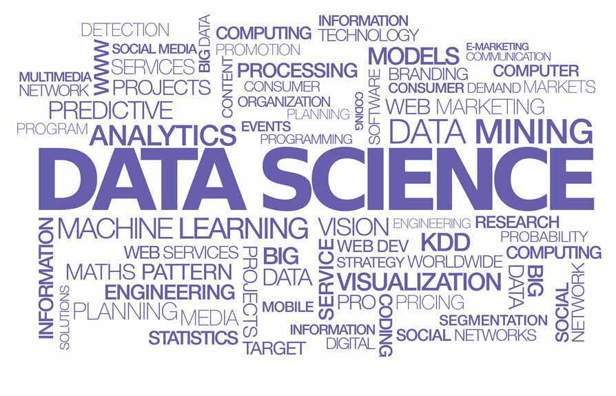

# Анализ резюме из HeadHunter (Проект 2)


## Примечание:
Поскольку на момент выполнения данного проекта cервис Github не поддерживает вывод графической информации библиотеки plotly.express, то для отображения графиков использовалась библиотека - kaleido.

Для установки kaleido:

```python
!pip install kaleido
```

Для сохранения графиков в формат png использовалась строка кода:
```python
fig_hist.write_image("images/graphic_1.png", engine="kaleido");
```

Файл *conversion_functions.py* содержит все функции используемые в проекте для обработки данных.

**Для работы с данным проектом использовался онлайн доступ к базе данных:**

DBNAME = ...

USER = ...

HOST = ...

PASSWORD = ...

PORT = ...

## Цель проекта

Закрепить полученные знания в использовании SQL запросов через код на языке python.

## Данный проект состоит из пяти частей:

1. предварительный анализ вакансий

2. детальный анализ вакансий

3. анализ работодателей

4. предметный анализ

5. дополнительно проведенны три исследования вакансий

## Проект оформлен согласно требованиям:

- Решение оформлено только в Jupyter Notebook.

- Решение оформлено в соответствии с ноутбуком-шаблоном (Project2).

- Каждое задание выполнено в отдельной ячейке, выделенной под задание.

- Код для каждого задания оформлен в одной-двух Jupyter-ячейках.

- В проекте использовались только: переменные, основные структуры данных (списки, кортежи), циклы, строки с sql запросами, библиотека plotly.

- При работе с проектом использовалось руководством PEP 8.

Графики содержут: 

1. название, отражающее их суть;

2. подписи осей.

Выводы к графикам оформлены в формате Markdown под самим графиком в отдельной ячейке.

Выводы представлены в виде заключений, сделан общий вывод по проекту. Дополнительно, проведены три коротких исследования с выводами.